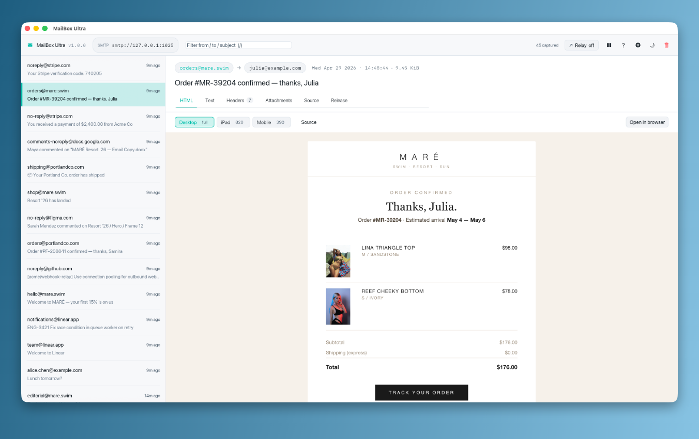
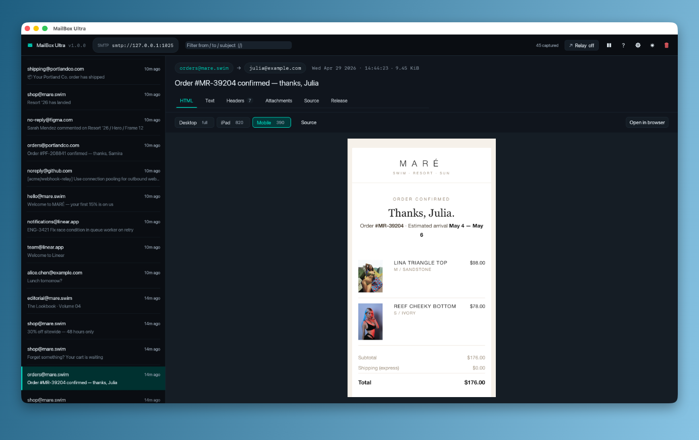

# MailBox Ultra

A native macOS SMTP fake inbox for developers. Drop the app into `/Applications`, point your dev environment at `localhost:1025`, and every email your app tries to send is parsed, stored, and shown to you in real time inside a real Mac app — no browser, no HTTP server, no Chromium.

[](https://github.com/MPJHorner/MailboxUltra/actions/workflows/ci.yml)
[](https://codecov.io/gh/MPJHorner/MailboxUltra)
[](https://github.com/MPJHorner/MailboxUltra/releases/latest)
[](https://mpjhorner.github.io/MailboxUltra/)
[](LICENSE)
[](https://www.rust-lang.org)
[](https://github.com/MPJHorner/MailboxUltra/releases/latest)

> **Full documentation: [mpjhorner.github.io/MailboxUltra](https://mpjhorner.github.io/MailboxUltra/)** · [Install](https://mpjhorner.github.io/MailboxUltra/install/) · [Quick start](https://mpjhorner.github.io/MailboxUltra/quick-start/) · [Preferences](https://mpjhorner.github.io/MailboxUltra/configuration/) · [Changelog](https://mpjhorner.github.io/MailboxUltra/changelog/)


## Why

Pointing your dev environment at a real SMTP relay is overkill, and a SaaS sandbox needs an account and an internet round-trip. MailBox Ultra is the local Mac alternative: a real SMTP server inside a real Mac app, on your machine, that catches every message your app tries to send without ever delivering one. HTML emails render inside the app via the system WebKit engine — the same one Mail.app uses.

## Install

> ### macOS — drag-to-install
>
> 1. Download `MailBoxUltra-<version>-universal.dmg` from the [latest release](https://github.com/MPJHorner/MailboxUltra/releases/latest).
> 2. Mount the DMG, drag **MailBox Ultra.app** into `/Applications`.
> 3. First launch: right-click the app, choose **Open** (one-time Gatekeeper prompt).

If you'd rather skip the right-click:

```sh
xattr -d com.apple.quarantine /Applications/MailBox\ Ultra.app
```

The full install guide (build-from-source, code-signing hooks, uninstall) is on the [install page](https://mpjhorner.github.io/MailboxUltra/install/).

## Quick start

Launch the app. The toolbar shows the SMTP URL it bound (default `smtp://127.0.0.1:1025`). Send anything to it:

```sh
swaks --to dev@example.com --from app@example.com \
  --server 127.0.0.1:1025 \
  --header "Subject: Hello from MailBoxUltra" \
  --body "It works."
```

The message lands in the inbox in milliseconds. Click it to inspect the HTML, plain text, every header, attachments (with **Save…** to disk), and the full RFC 822 source.

## What it looks like

|  Light mode — order confirmation  |  Mobile (390) — Resort '26 order  |
| --- | --- |
|  |  |

The HTML pane uses the system `WKWebView` to render captured email HTML pixel-perfectly. The **Desktop / iPad / Mobile** buttons resize the preview frame *and* swap the User-Agent so responsive emails (with `@media (max-width: 540px)` rules and a viewport meta tag) reflow exactly the way they would in iOS Mail.

## Features

- **Real SMTP** — HELO, EHLO, MAIL FROM, RCPT TO, DATA, RSET, NOOP, QUIT, AUTH PLAIN, AUTH LOGIN. Anything that speaks RFC 5321 just works.
- **Native window** — real Mac dock icon, native menus, `⌘,` for Preferences, `⌘Q` to quit. Window position and theme persist across launches.
- **WebKit HTML preview** — captured HTML emails render inside the app via `WKWebView`. JavaScript disabled, links intercepted and shelled to your default browser. Sandboxed.
- **Device-size preview** — Desktop / iPad (820px) / Mobile (390px) buttons resize the preview frame and switch the UA so `@media` queries fire correctly.
- **Relay mode** — optional upstream `smtp://` or `smtps://` URL. Capture for inspection, then forward to a real MTA. Toggle without restarting the SMTP listener.
- **NDJSON log** — optional path to a JSON-lines log file. Tail it from a script or pair it with a coding agent watching alongside you.
- **Bundled icon** — the .app ships with a hand-drawn icon that pops on the macOS dock. Source SVG in `icon/icon.svg`.

## Configuration

Open **Preferences** with `⌘,` (or the gear button in the toolbar). Every flag the old CLI binary had is now a Settings field, plus theme:

- **Servers** — SMTP port, bind address.
- **SMTP** — hostname, max message size, optional AUTH PLAIN / AUTH LOGIN credentials.
- **Capture** — buffer size (the inbox is a ring buffer; older messages are evicted past this).
- **Relay** — optional upstream `smtp://` / `smtps://` URL. Each captured message is forwarded after capture.
- **Logging** — optional path to an NDJSON log file (one JSON object per captured message, append-only, never truncated).
- **Appearance** — System / Dark / Light.

Click **Apply** and the relevant servers restart in place. Captured messages are preserved across an SMTP restart up to the new buffer size. Settings persist in `~/Library/Application Support/com.mpjhorner.MailBoxUltra/settings.json`.

## Keyboard shortcuts

| Key | Action |
|---|---|
| `j` / `↓` | Next message |
| `k` / `↑` | Previous message |
| `g` / `G` | Jump to newest / oldest |
| `/` | Focus search |
| `1` – `6` | Switch detail tab (HTML / Text / Headers / Attachments / Source / Release) |
| `p` | Pause / resume capture display |
| `d` | Delete current message |
| `⇧⌘X` | Clear all |
| `t` | Toggle theme |
| `⌘,` | Open Preferences |
| `?` | Show shortcuts cheat sheet |
| `Esc` | Close dialog / blur search |

## Development

Working on the app itself? Three flows cover most of it:

```sh
# 1. iterate on the code with cargo run (debug, no .app bundle)
make run

# 2. build a release .app bundle and launch it like a real Mac install
make app
open target/aarch64-apple-darwin/release/MailBoxUltra.app

# 3. fire varied real-world-looking emails at the running app
./scripts/simulate.py            # all scenarios except burst
./scripts/simulate.py mare-drop  # one scenario
./scripts/simulate.py burst -n 200   # ring-buffer stress test
make simulate-list               # show every scenario
```

`scripts/simulate.py` is stdlib-only Python 3.9+ (already on macOS) so it works on a fresh checkout — no `pip install` step. The default run interleaves work emails (Linear / GitHub / Figma / Stripe / Apple), newsletters, and ecommerce templates (a fictional bikini brand "MARÉ" with real Unsplash imagery, fully responsive) so the inbox looks like a real day's mail.

`make check` runs the full pre-commit gate (`cargo fmt --check`, `cargo clippy --all-targets --all-features -- -D warnings`, `cargo test --all-features`) — the same thing CI runs.

## Documentation

The [docs site](https://mpjhorner.github.io/MailboxUltra/) is the canonical user-facing reference:

- **[Install](https://mpjhorner.github.io/MailboxUltra/install/)** — DMG, Gatekeeper, build-from-source, uninstall
- **[Quick start](https://mpjhorner.github.io/MailboxUltra/quick-start/)** — first message in 30 seconds
- **[Preferences](https://mpjhorner.github.io/MailboxUltra/configuration/)** — every Settings field, every restart semantic
- **[SMTP](https://mpjhorner.github.io/MailboxUltra/smtp/)** — supported verbs, AUTH, message size limits
- **[Relay](https://mpjhorner.github.io/MailboxUltra/relay/)** — capture + forward to upstream MTA
- **[Logging](https://mpjhorner.github.io/MailboxUltra/logging/)** — NDJSON file format, schema, examples
- **[Use cases](https://mpjhorner.github.io/MailboxUltra/use-cases/)** — the workflows it's built for
- **[Comparison](https://mpjhorner.github.io/MailboxUltra/comparison/)** — vs Mailpit, MailHog, MailCatcher, SaaS
- **[Contributing](https://mpjhorner.github.io/MailboxUltra/contributing/)** — workspace layout, test policy
- **[Changelog](https://mpjhorner.github.io/MailboxUltra/changelog/)** — every release

## Contributing

Issues and pull requests welcome. `make check` before submitting; if you're adding a feature, add a test alongside. `gui/` and `main.rs` are coverage-exempt (egui is immediate-mode, the data structures it consumes are tested independently).

## License

[MIT](LICENSE) © 2026 MPJHorner.
