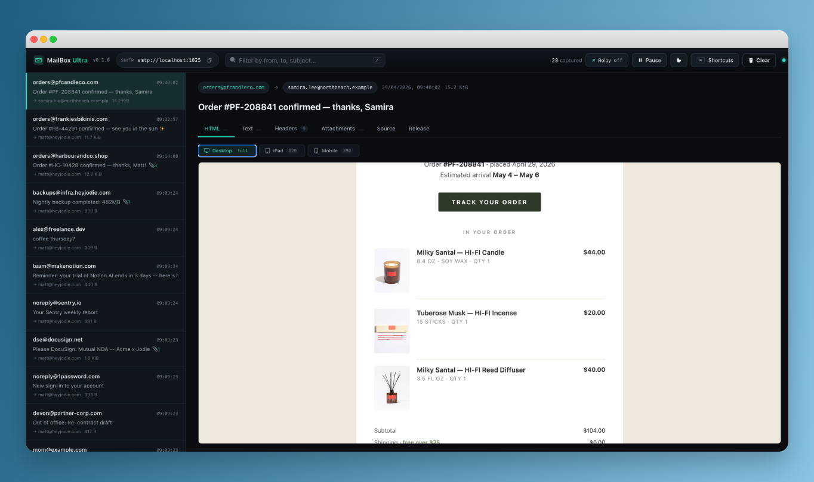

# MailBox Ultra

A native macOS SMTP fake inbox for developers. Drop the app into `/Applications`, point your dev environment at `localhost:1025`, and every email your app tries to send is parsed, stored, and shown to you in real time inside a real Mac app — no browser, no HTTP server, no Chromium.

[](https://github.com/MPJHorner/MailboxUltra/actions/workflows/ci.yml)
[](https://github.com/MPJHorner/MailboxUltra/actions/workflows/ci.yml)
[](https://codecov.io/gh/MPJHorner/MailboxUltra)
[](https://github.com/MPJHorner/MailboxUltra/releases/latest)
[](LICENSE)
[](https://www.rust-lang.org)
[](https://github.com/MPJHorner/MailboxUltra/releases/latest)

> **macOS 11 (Big Sur) or newer.** Windows and Linux builds are no longer produced.



## Why

Pointing your dev environment at a real SMTP relay is overkill, and a SaaS sandbox needs an account and an internet round-trip. MailBox Ultra is the local alternative: a real SMTP server inside a real Mac app, on your machine, that catches every message your app tries to send without ever delivering one. HTML emails render inside the app via the system WebKit engine, the same one Mail.app uses.

## Install

1. Download `MailBoxUltra-<version>-universal.dmg` from the [latest release](https://github.com/MPJHorner/MailboxUltra/releases/latest).
2. Mount the DMG and drag **MailBox Ultra.app** into `/Applications`.
3. First launch: right-click the app in `/Applications` and choose **Open** so macOS lets the unsigned build through Gatekeeper. Subsequent launches just need a double-click.

If you'd rather skip the right-click step, run:

```sh
xattr -d com.apple.quarantine /Applications/MailBox\ Ultra.app
```

### Build from source

```sh
git clone https://github.com/MPJHorner/MailboxUltra.git
cd MailboxUltra
make icon          # generates icon/AppIcon.icns
make app           # builds target/.../release/MailBoxUltra.app
make dmg           # packages it into a .dmg
open target/aarch64-apple-darwin/release/MailBoxUltra.app
```

`make app-universal` builds an Intel + Apple Silicon universal binary.

## Quick start

Launch the app. The toolbar shows the SMTP URL it bound; defaults to `smtp://127.0.0.1:1025`. Send a message from any client:

```sh
swaks --to dev@example.com --from app@example.com \
  --server 127.0.0.1:1025 \
  --header "Subject: Hello from MailBoxUltra" \
  --body "It works."
```

The message appears in the inbox in milliseconds. Click it to see the HTML, the plain text part, every header, attachments (with **Save…** to disk), and the full raw RFC 822 source.

## Configuration

Open **Preferences** with `⌘,` (or the gear button in the toolbar). Every flag the old CLI binary had is now a Settings field, plus theme:

- **Servers** — SMTP port, bind address.
- **SMTP** — hostname, max message size, optional AUTH PLAIN / AUTH LOGIN credentials.
- **Capture** — buffer size (the inbox is a ring buffer; older messages are evicted past this).
- **Relay** — optional upstream `smtp://` or `smtps://` URL. Each captured message is forwarded after capture.
- **Logging** — optional path to an NDJSON log file (one JSON object per captured message, append-only, never truncated).
- **Appearance** — System / Dark / Light.

Click **Apply** and the relevant servers restart in place. Captured messages are preserved across an SMTP restart up to the new buffer size.

## Keyboard shortcuts

| Key | Action |
|---|---|
| `j` / `↓` | Next message |
| `k` / `↑` | Previous message |
| `g` / `G` | Jump to newest / oldest |
| `/` | Focus search |
| `1` – `6` | Switch detail tab |
| `p` | Pause / resume capture display |
| `d` | Delete current message |
| `⇧⌘X` | Clear all |
| `t` | Toggle theme |
| `⌘,` | Open Preferences |
| `?` | Show shortcuts cheat sheet |
| `Esc` | Close dialog / blur search |

## Development

Working on the app itself? Three flows cover most of it:

```sh
# 1. iterate on the code with cargo run (debug, no .app bundle)
make run

# 2. build a release .app bundle and launch it like a real Mac install
make app
open target/aarch64-apple-darwin/release/MailBoxUltra.app

# 3. fire varied real-world-looking emails at the running app
./scripts/simulate.py            # all scenarios except burst
./scripts/simulate.py receipt    # one scenario
./scripts/simulate.py burst -n 200   # ring-buffer stress test
make simulate                    # convenience wrapper
make simulate-list               # show every scenario
```

`scripts/simulate.py` is stdlib-only Python 3.9+ (already on macOS) so it
works on a fresh checkout — no `pip install` step. See
[`scripts/README.md`](scripts/README.md) for the full scenario list (HTML
transactional, marketing, attachments, calendar invites, dark-mode aware
HTML, RFC 2047 encoded subjects, multi-recipient, burst, etc).

`make check` runs the full pre-commit gate (`cargo fmt --check`, `cargo
clippy --all-targets --all-features -- -D warnings`, `cargo test
--all-features`) — the same thing CI runs.

## License

[MIT](LICENSE) © 2026 MPJHorner.
